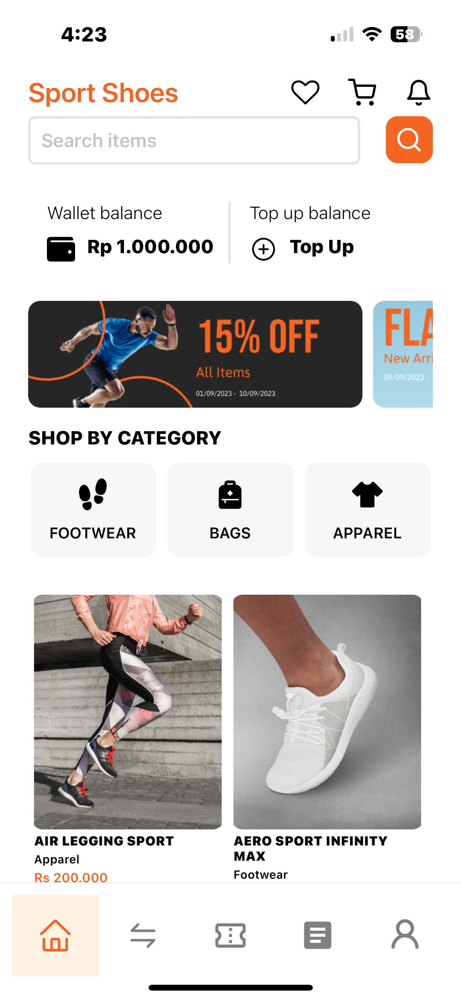

# Sport Shoes App

## Overview
The **Sport Shoes App** is a mobile application built with React Native, designed for users to browse and shop for various sports shoes. It features a modern UI, user notifications, wallet balance management, and category browsing, providing an engaging shopping experience.

## Features
- Browse through various categories of shoes
- Wallet balance management
- Notifications for user activities
- Search functionality to find specific items
- Responsive design for an optimal mobile experience

## Screenshots
Below are some screenshots showcasing the app's interface:

 
 
 

## Getting Started

### Prerequisites
- Node.js (version x.x.x)
- npm (version x.x.x)
- Expo CLI (version x.x.x) or React Native CLI

### Installation
1. Clone the repository:
   ```bash
   git clone https://github.com/your-username/sport-shoes-app.git
